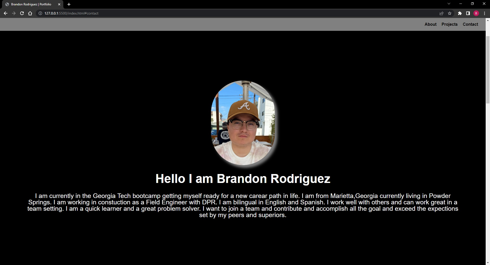
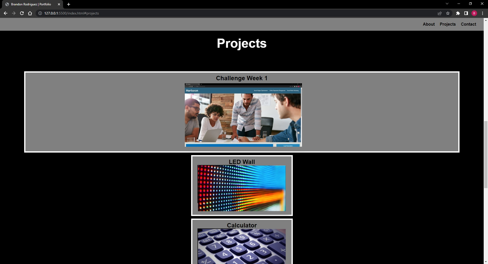
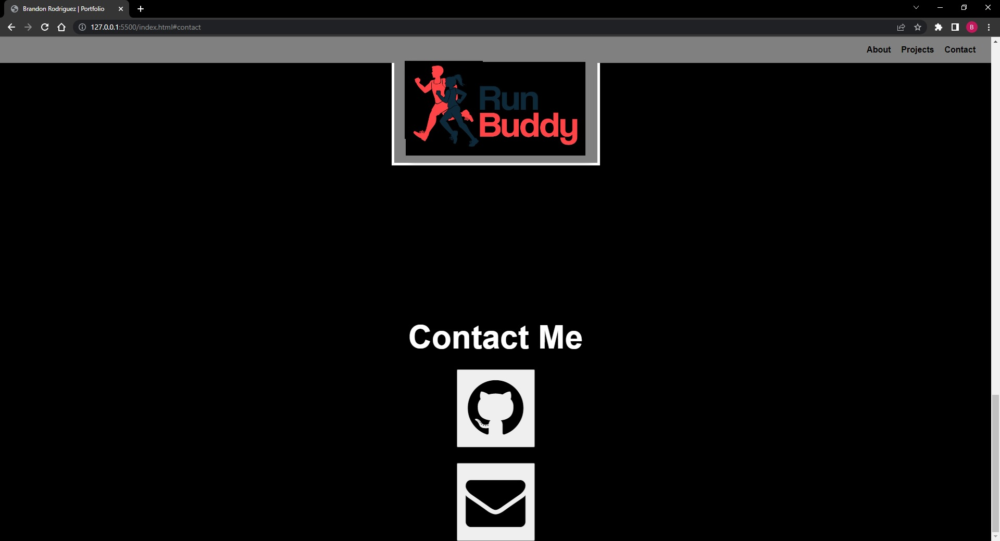

# Portfolio

## Overview
This project was created so future employers can read about myself, view projects I have created, and get in contact with me.
There is a link to my github account along with a link to send an email to me. This project differed from the previous one
by not having a starter code. We had to create everything from scratch which did make it take more time and was a bigger 
challenge than the last one but nevertheless was a good learning experince and definitely helped me learn more about HTML and CSS.

## Link to Live Webpage
https://frutaseca.github.io/Portfolio/

## Picture of Webpage

